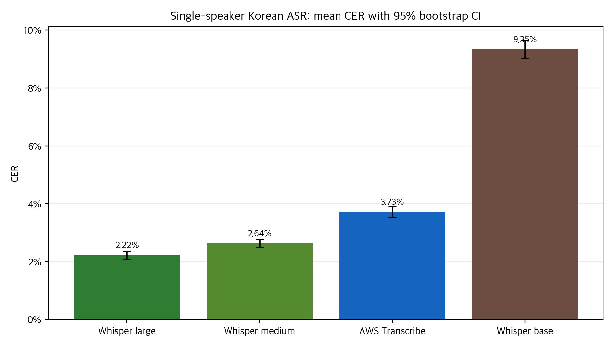
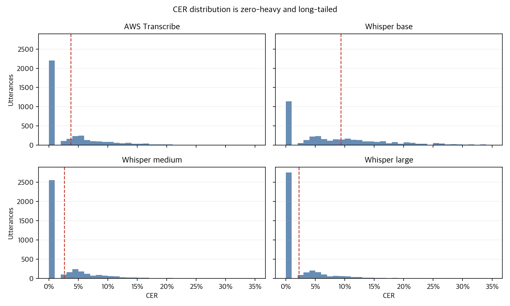
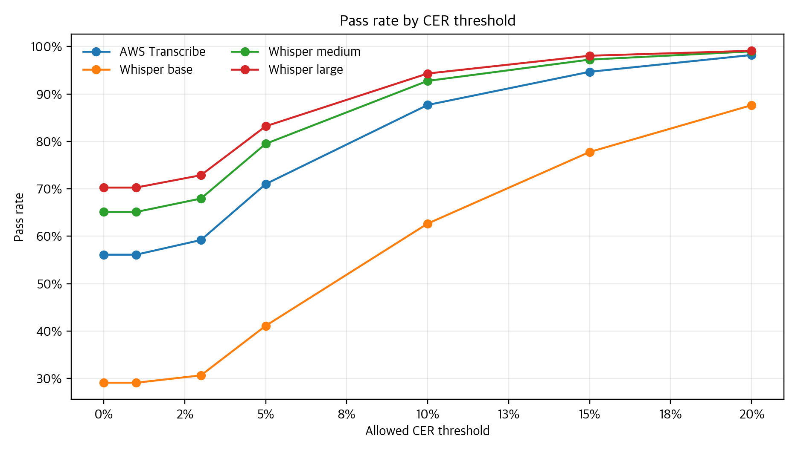
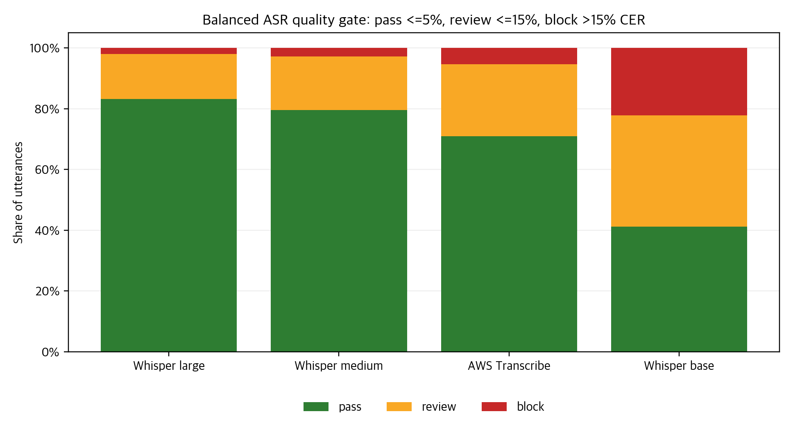
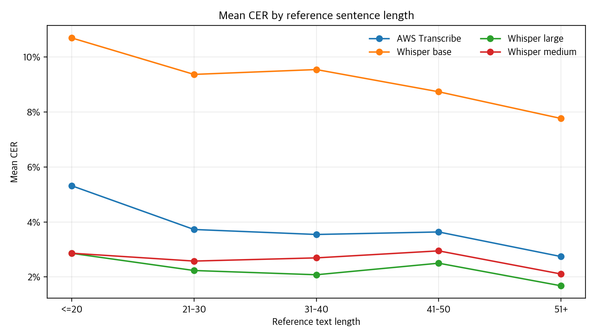
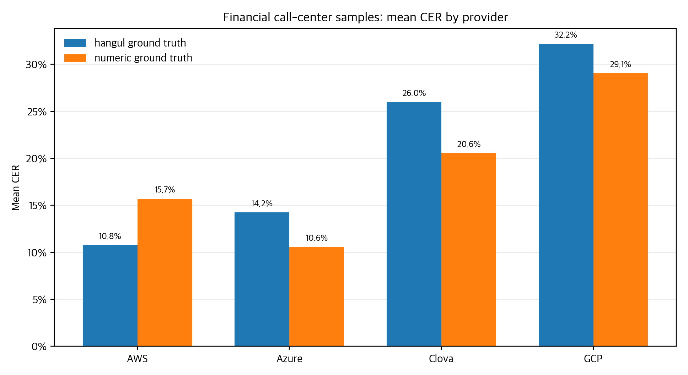
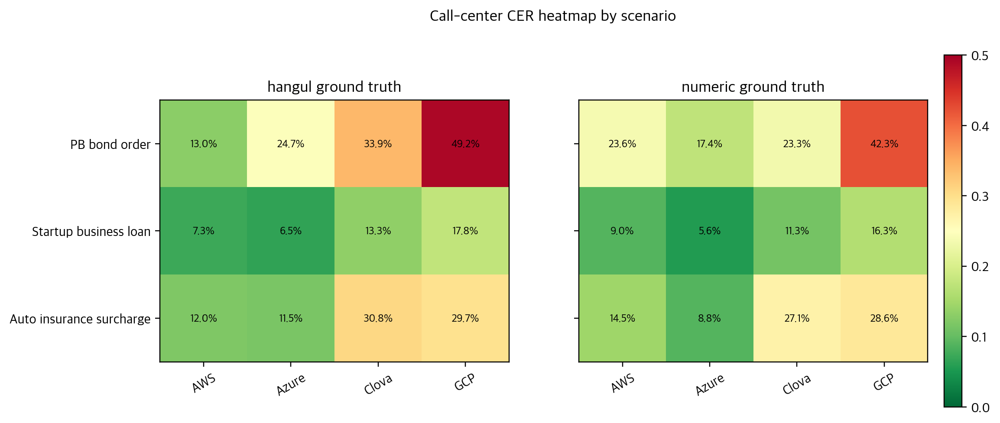

# 한국어 ASR 벤치마크 다시 보기

Status: draft  
Project: `job-transcribe`  
Source analysis: `analysis/analyze_asr_benchmarks.py`

## 요약

2023년에 내가 직접 설계하고 수행했던 한국어 ASR/STT 벤치마크를 다시 정리했다. 당시의 목표는 공개 제품과 공개 모델을 기준으로 한국어 음성 인식 결과를 비교하는 것이었다. 이번 재정리의 목표는 같은 결과 파일을 사용해 평균 CER 하나가 아니라 분포, threshold, worst case, 모델 간 disagreement, 콜센터 시나리오별 민감도까지 함께 읽는 것이다.

이 분석은 레포에 남아 있는 실제 결과 CSV, JSON, TXT만 사용한다. 새 mock CSV는 만들지 않았고, 본문에 쓰는 표와 차트는 `analysis/analyze_asr_benchmarks.py`에서 재생성되는 파생 산출물이다.

중요한 범위부터 분명히 한다. 이 결과는 2023년에 공개적으로 접근 가능한 제품과 오픈소스 모델을 사용해 수행한 개인 프로젝트성 실험 결과다. 2026년 재정리 시점의 Microsoft/Azure, AWS, Clova, GCP, OpenAI/Whisper 제품 성능을 대표하지 않으며, 각 회사의 공식 벤치마크나 내부 성능 데이터가 아니다. 이 글에서 vendor와 model 이름은 당시 실험의 비교 대상 라벨로만 사용한다.

## 실험 데이터

실험은 두 갈래로 나뉜다.

첫 번째는 단일 화자 한국어 문장 3,922건이다. 같은 데이터셋에 대해 AWS Transcribe, Whisper base, Whisper medium, Whisper large 결과를 비교했다. 이 데이터셋은 모델별 기본 인식 성능, 분포, threshold 통과율, 모델 간 paired comparison을 보기 위한 중심 데이터다.

두 번째는 금융 콜센터를 가정한 3개 시나리오다. PB 채권 주문 상담, 신생기업 대출 안내 상담, 자동차 보험료 할증 문의 상담을 AWS, Azure, Clova, GCP 결과와 비교했다. 이 데이터는 표본 수가 작기 때문에 provider ranking으로 쓰지 않는다. 대신 도메인 용어, 숫자 표기, 상담형 문맥에서 오류 양상이 어떻게 달라지는지 보는 case analysis로 다룬다.

원천 파일은 다음과 같다.

| Area | Source files |
|---|---|
| Single speaker | `meta_voice_data_3922.csv`, `result/result_3922.csv`, `result/openai_whisper_base_result_3922.csv`, `result/openai_whisper_medium_result_3922.csv`, `result/openai_whisper_large_result_3922.csv` |
| Call center | `preprocess/cs_hangul_data.csv`, `preprocess/cs_num_data.csv`, `result/cs_hangul_result.csv`, `result/cs_number_result.csv` |
| Raw/intermediate call-center outputs | `tmp_data/aws/*`, `tmp_data/azure/*`, `tmp_data/clova/*`, `tmp_data/gcp/*`, `tmp_data/groundtruth/*` |

## 평가 방법

기본 지표는 CER(Character Error Rate)다. CER는 정답 문장과 인식 결과 문장 사이의 문자 단위 편집 거리 기반 오류율이다. 한국어 STT에서는 띄어쓰기, 숫자 표기, 영문/고유명사 표기, 문장부호 처리에 따라 CER가 민감하게 변할 수 있다. 그래서 이 글에서는 CER를 핵심 지표로 쓰되, CER 하나로 품질을 단정하지 않는다.

이번 재분석에서는 기존 결과 CSV의 `cer` 값을 그대로 사용한다. 블로그 작성 단계에서 공백, 문장부호, 영문 대소문자, 숫자를 새로 정규화해 CER를 재계산하지 않았다. 향후 다른 정규화 정책을 적용한다면, 2023년 결과와 분리해서 별도 지표로 표시해야 한다.

단일 화자 데이터는 다음 지표로 읽었다.

| Metric | Why it matters |
|---|---|
| Mean/median CER | 전체적인 오류 수준과 typical case를 함께 보기 위함 |
| Bootstrap 95% CI | 평균 CER 추정의 안정성을 보기 위함 |
| Perfect recognition rate | 완전 인식 비중을 보기 위함 |
| Threshold pass rate | 제품/운영 관점에서 허용 가능한 품질 기준을 가정하기 위함 |
| Paired delta | 같은 문장에 대해 모델 간 우열이 얼마나 반복되는지 보기 위함 |
| Worst/disagreement examples | 평균이 숨기는 tail risk와 오류 유형을 확인하기 위함 |
| Length-bin performance | 문장 길이에 따른 오류율 변화를 보기 위함 |

## 단일 화자 3,922문장 결과

단일 화자 데이터에서 평균 CER가 가장 낮은 모델은 Whisper large였다. Whisper large의 평균 CER는 2.22%, Whisper medium은 2.64%, AWS Transcribe는 3.73%, Whisper base는 9.35%였다. 중앙값은 Whisper large, Whisper medium, AWS Transcribe가 모두 0.00%였고, Whisper base는 6.94%였다.

| Model | Mean CER | Median CER | Perfect | <=5% CER | >10% CER |
|---|---:|---:|---:|---:|---:|
| Whisper large | 2.22% | 0.00% | 70.27% | 83.20% | 5.69% |
| Whisper medium | 2.64% | 0.00% | 65.12% | 79.50% | 7.24% |
| AWS Transcribe | 3.73% | 0.00% | 56.12% | 71.01% | 12.32% |
| Whisper base | 9.35% | 6.94% | 29.12% | 41.13% | 37.33% |

Source: `analysis/outputs/model_performance_summary.md`



Figure 1. 단일 화자 3,922문장 기준 평균 CER와 95% bootstrap confidence interval.  
Source: `result/*.csv`, generated by `analysis/analyze_asr_benchmarks.py`.

평균만 보면 Whisper large와 Whisper medium의 차이가 작아 보인다. 하지만 완전 인식률과 threshold 통과율을 같이 보면 차이가 더 명확해진다. Whisper large는 70.27%의 문장을 완전히 맞췄고, CER 5% 이하 기준으로는 83.20%를 통과했다. Whisper medium은 각각 65.12%, 79.50%였다. AWS Transcribe는 Whisper base보다 안정적이지만, 이 데이터와 당시 설정 기준에서는 Whisper medium/large보다 평균 CER와 threshold 통과율이 낮았다.



Figure 2. CER 분포는 zero-heavy이면서 long tail을 가진다.  
Source: `analysis/outputs/single_speaker_long.csv`, generated by `analysis/analyze_asr_benchmarks.py`.

이 분포가 중요한 이유는 단순하다. 많은 문장은 완전히 맞거나 거의 맞지만, 일부 문장은 모델별로 크게 흔들린다. 평균 CER가 낮아도 tail risk가 크면 운영 품질 관점에서는 별도 처리 기준이 필요하다.

## Threshold로 다시 읽기

실제 제품이나 워크플로에서는 "평균 CER가 몇 퍼센트인가"보다 "내가 정한 품질 기준을 몇 퍼센트나 통과하는가"가 더 중요할 때가 많다. 그래서 0%, 1%, 3%, 5%, 10%, 15%, 20% threshold별 pass rate를 계산했다.



Figure 3. CER threshold를 완화할수록 모델별 pass rate 격차가 다르게 줄어든다.  
Source: `analysis/outputs/single_speaker_threshold_pass_rates.csv`.

CER 5% 이하를 pass 기준으로 잡으면 Whisper large는 83.20%, Whisper medium은 79.50%, AWS Transcribe는 71.01%, Whisper base는 41.13%를 통과한다. CER 10% 이하로 완화하면 Whisper large는 94.31%, Whisper medium은 92.76%, AWS Transcribe는 87.68%, Whisper base는 62.67%까지 올라간다.

이 관점에서는 Whisper base의 문제가 더 분명해진다. 평균 CER 9.35%라는 숫자도 크지만, CER 10% 초과 문장이 37.33%라는 점이 더 직접적인 risk다.

## Paired comparison

모델 비교에서는 같은 문장을 놓고 비교해야 한다. 단일 화자 3,922건은 4개 모델이 같은 `file_name` 집합을 갖는지 검증한 뒤 paired delta를 계산했다.

| Comparison | Mean CER delta | Better count | Worse count | Tie count | Better rate excluding ties |
|---|---:|---:|---:|---:|---:|
| Whisper large vs AWS Transcribe | -1.50 pp | 1,158 | 414 | 2,350 | 73.66% |
| Whisper large vs Whisper medium | -0.41 pp | 594 | 319 | 3,009 | 65.06% |
| Whisper medium vs AWS Transcribe | -1.09 pp | 1,066 | 579 | 2,277 | 64.80% |
| AWS Transcribe vs Whisper base | -5.62 pp | 2,195 | 467 | 1,260 | 82.46% |

Source: `analysis/outputs/single_speaker_paired_deltas.csv`

여기서 delta는 왼쪽 모델의 CER에서 오른쪽 모델의 CER를 뺀 값이다. 음수이면 왼쪽 모델의 CER가 더 낮다는 뜻이다.

Whisper large는 AWS Transcribe보다 평균 CER가 1.50 percentage point 낮았고, tie를 제외하면 73.66%의 non-tie 문장에서 더 낮은 CER를 보였다. Whisper large와 Whisper medium은 tie가 3,009건으로 매우 많았다. 즉 둘의 차이는 전체 평균에서는 보이지만, 많은 문장에서는 동일한 CER로 묶인다.

## 운영 임계값 시뮬레이션

모델을 실제 workflow에 붙인다고 가정하면 결과를 세 구간으로 나눌 수 있다.

| State | Rule |
|---|---|
| Pass | CER <= 5% |
| Review | 5% < CER <= 15% |
| Block | CER > 15% |

이 기준은 특정 vendor나 프레임워크 개념이 아니라, ASR 품질을 사람이 검수할지 자동 통과시킬지 나누기 위한 단순한 운영 임계값 예시다.

| Model | Pass | Review | Block |
|---|---:|---:|---:|
| Whisper large | 83.20% | 14.86% | 1.94% |
| Whisper medium | 79.50% | 17.75% | 2.75% |
| AWS Transcribe | 71.01% | 23.66% | 5.33% |
| Whisper base | 41.13% | 36.64% | 22.23% |

Source: `analysis/outputs/quality_gate_policy_simulation.csv`



Figure 4. CER 5% 이하 pass, 15% 이하 review, 15% 초과 block으로 나눈 운영 임계값 시뮬레이션.  
Source: `analysis/outputs/quality_gate_policy_simulation.csv`.

이 표는 모델 선택표라기보다 후처리 비용을 보는 표에 가깝다. 예를 들어 Whisper large 기준으로는 1.94%가 block 영역에 남지만, Whisper base는 22.23%가 block 영역에 남는다. 같은 평균 비교보다 검수 queue나 fallback 정책을 설계할 때 더 직접적으로 읽힌다.

## 문장 길이와 오류율

문장 길이 구간별 평균 CER도 계산했다. 단순히 긴 문장이 항상 어렵다고 말하기는 어렵다. 이 데이터에서는 모델별로 길이와 CER의 선형 상관이 강하지 않았고, 일부 짧은 문장에서도 고유명사나 외래어 때문에 큰 오류가 발생했다.



Figure 5. 정답 문장 길이 구간별 평균 CER.  
Source: `analysis/outputs/single_speaker_length_bins.csv`.

문장 길이보다 더 중요한 것은 표현 유형이었다. 외래어, 영문 표기, 고유명사, 숫자, 동음이의에 가까운 발음은 짧은 문장에서도 오류를 크게 만들었다.

## 오류 사례

Worst case와 disagreement case를 보면 평균 표에서 보이지 않는 문제가 드러난다.

| Pattern | Example observation |
|---|---|
| 영문/외래어 표기 | "미디엄 웰던", "스퀘어 스톤", "사우스웨스트 에어라인"처럼 한국어 음성과 영문 표기 사이에서 CER가 커지는 사례 |
| 고유명사 | 인명, 제품명, 지명, 그룹명에서 모델별 표기 방식이 갈리는 사례 |
| 반복/환각성 출력 | 일부 Whisper base 출력에서 영어 문장이나 의미 없는 토큰이 섞이며 CER가 크게 증가한 사례 |
| 숫자와 발음 | 숫자, 날짜, 수량 표현이 한글 표기와 숫자 표기 사이에서 민감하게 바뀌는 사례 |

Source: `analysis/outputs/single_speaker_worst_examples.csv`, `analysis/outputs/single_speaker_disagreement_examples.csv`

대표적인 disagreement 사례에서는 Whisper base만 크게 틀리고 다른 모델은 맞는 경우가 반복적으로 보였다. 반대로 "미디엄 웰던"처럼 Whisper large가 영문 표기로 출력하면서 CER가 크게 올라가는 사례도 있었다. 이 지점은 CER 해석에서 특히 조심해야 한다. 의미상 맞거나 사용자가 받아들일 수 있는 표기라도, 정답지와 문자 단위 표기가 다르면 CER는 크게 오른다.

## 콜센터 시나리오

콜센터 데이터는 단일 화자 벤치마크와 성격이 다르다. 표본은 3개 시나리오뿐이고, 상담형 문맥, 금융/보험 용어, 숫자, 발화 흐름의 영향을 받는다. 따라서 아래 표는 provider ranking 근거가 아니라 시나리오별 오류 양상을 보기 위한 보조 요약이다.

| Basis | Provider | Mean CER | Median CER | Max CER |
|---|---|---:|---:|---:|
| hangul ground truth | AWS | 10.77% | 11.99% | 13.04% |
| hangul ground truth | Azure | 14.24% | 11.54% | 24.72% |
| hangul ground truth | Clova | 26.01% | 30.80% | 33.91% |
| hangul ground truth | GCP | 32.20% | 29.67% | 49.18% |
| numeric ground truth | Azure | 10.59% | 8.79% | 17.43% |
| numeric ground truth | AWS | 15.71% | 14.51% | 23.64% |
| numeric ground truth | Clova | 20.56% | 23.33% | 27.10% |
| numeric ground truth | GCP | 29.06% | 28.58% | 42.32% |

Source: `analysis/outputs/model_performance_summary.md`



Figure 6. 금융 콜센터 3개 시나리오의 provider별 평균 CER. 이 그림은 ranking이 아니라 case summary로만 읽어야 한다.  
Source: `analysis/outputs/call_center_provider_summary.csv`.

한글 표기 정답지 기준에서는 AWS 평균 CER가 10.77%, Azure가 14.24%였다. 숫자 표기 정답지 기준에서는 Azure 평균 CER가 10.59%, AWS가 15.71%였다. 이 차이는 "어느 provider가 더 좋다"보다 "정답지 표기 정책이 결과를 얼마나 바꾸는가"를 보여준다.



Figure 7. 시나리오 x provider CER heatmap. 콜센터 데이터는 3개 시나리오의 case analysis로 해석한다.  
Source: `analysis/outputs/call_center_long.csv`.

시나리오별로 보면 PB 채권 주문 상담이 여러 provider에서 높은 CER를 보였다. 한글 정답지 기준 GCP의 PB bond order CER는 49.18%, Clova는 33.91%, Azure는 24.72%, AWS는 13.04%였다. 숫자 표기 정답지에서도 PB 시나리오는 대체로 어렵게 남는다. 금융 도메인에서 숫자, 상품명, 주문 맥락이 결합되면 단일 화자 문장과 다른 오류 양상이 나타난다.

## Model Performance Explorer

블로그의 인터랙티브 영역은 독자가 threshold를 직접 바꿔보는 방식으로 설계한다. 기본 뷰는 단일 화자 데이터의 pass rate chart다. dataset을 call center로 바꾸면 provider 목록과 basis 선택이 함께 바뀌어야 한다.

필수 동작은 다음과 같다.

| Control | Single speaker | Call center |
|---|---|---|
| Dataset selector | 3,922문장 벤치마크 | 금융 콜센터 3개 시나리오 |
| Model/provider selector | AWS Transcribe, Whisper base, Whisper medium, Whisper large | AWS, Azure, Clova, GCP |
| Threshold slider | CER threshold별 pass rate | 선택 threshold 이하 scenario 비중 |
| Summary panel | mean, median, perfect, pass, block | basis별 mean, median, max, scenario count |

이 UI에서 가장 중요한 원칙은 hover-only로 숨기지 않는 것이다. 핵심 수치인 pass rate, mean CER, threshold는 항상 화면에 표시되어야 한다. 모바일에서는 hover 대신 tap/focus interaction을 제공하고, chart와 control이 세로로 자연스럽게 쌓여야 한다.

## 재현 방법

분석은 다음 명령으로 재생성할 수 있다.

```bash
uv run --python /usr/bin/python3 --with pandas --with numpy --with matplotlib python analysis/analyze_asr_benchmarks.py
```

스크립트는 다음 무결성 검사를 수행한다.

| Check | Purpose |
|---|---|
| 단일 화자 4개 결과 CSV의 `file_name` 집합 일치 | paired comparison이 같은 샘플을 비교하는지 확인 |
| 콜센터 결과 row count와 scenario count 일치 | 3개 시나리오 매핑 오류 방지 |
| 필수 컬럼 존재 여부 | 원천 결과 파일 구조 변경 감지 |

재생성되는 대표 산출물은 다음과 같다.

- `analysis/outputs/single_speaker_model_summary.csv`
- `analysis/outputs/single_speaker_threshold_pass_rates.csv`
- `analysis/outputs/single_speaker_paired_deltas.csv`
- `analysis/outputs/single_speaker_worst_examples.csv`
- `analysis/outputs/single_speaker_disagreement_examples.csv`
- `analysis/outputs/call_center_long.csv`
- `analysis/outputs/call_center_provider_summary.csv`
- `analysis/outputs/quality_gate_policy_simulation.csv`
- `blog/assets/*.png`

## 한계

이 분석에는 명확한 한계가 있다.

첫째, 시간적 한계가 있다. 결과는 2023년 당시 공개 제품과 공개 모델 상태를 반영한다. 현재 제품 성능, SLA, vendor capability, procurement decision을 대표하지 않는다.

둘째, 데이터 범위의 한계가 있다. 단일 화자 3,922건은 같은 화자와 녹음 조건 안에서의 비교다. 다른 화자군, 방언, 장비, 배경소음, 실시간 스트리밍 환경으로 일반화하지 않는다.

셋째, 콜센터 데이터는 3개 시나리오의 case analysis다. 평균과 중앙값은 보조 요약이며 provider ranking 근거로 사용하지 않는다.

넷째, CER의 한계가 있다. CER는 문자 단위 지표이므로 의미 보존, 화자 분리, 타임스탬프 품질, punctuation quality, downstream task utility를 직접 평가하지 않는다.

다섯째, 정규화 민감도가 있다. 한국어 숫자 표기, 띄어쓰기, 문장부호, 영문/고유명사 표기에 따라 CER가 크게 달라질 수 있다.

## 결론

이 프로젝트를 다시 정리하면서 가장 분명해진 점은 한국어 ASR 평가는 평균 CER 하나로 끝나지 않는다는 것이다. 단일 화자 데이터에서는 Whisper large와 Whisper medium이 강한 결과를 보였고, AWS Transcribe는 Whisper base보다 안정적이었다. 하지만 이 결론은 2023년 당시의 공개 제품/공개 모델, 이 레포의 데이터셋, 기존 CER 산출 방식 안에서만 유효하다.

더 중요한 것은 읽는 방식이다. 완전 인식률, threshold pass rate, tail risk, paired comparison, disagreement example을 함께 봐야 실제 사용 조건에 가까운 판단이 가능하다. 콜센터 시나리오에서는 표본 수가 작기 때문에 ranking보다 숫자 표기, 도메인 용어, 상담형 맥락이 오류율을 어떻게 바꾸는지 보는 편이 더 타당하다.

`job-transcribe`는 단순한 과거 실험 레포가 아니라, 한국어 ASR 평가를 재현 가능한 데이터 분석과 읽기 쉬운 시각화로 다시 보여주는 프로젝트로 정리된다.
